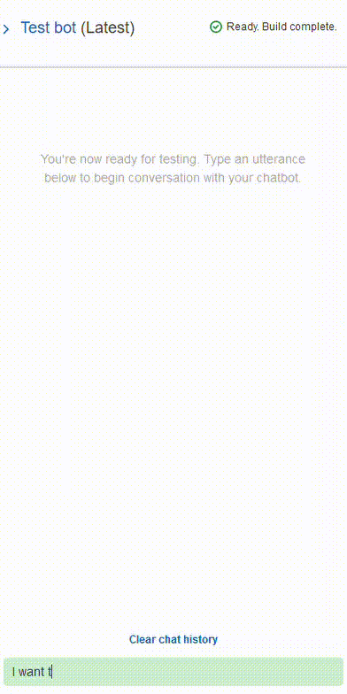

# Unit 13 Homework Assignment - Robo Advisor for Retirement Plans

### Background

For this assignment, a robo advisor was created using Amazon Lex and Amazon Lambda to help customers or potential new customers to get investment portfolio recommendations for retirement.

---

### Files

* [Bot Configuration](RoboAdvisor_1_923f717b-36b3-408f-930d-7ac22dde1ca9_Bot_LEX_V1.zip)
* [lambda_function.py](lambda_function.py)
* [correct_dialog.txt](Test_Cases/correctDialog.txt)
* [age_error.txt](Test_Cases/ageError.txt)
* [incorrect_amount_error.txt](Test_Cases/incorrectAmountError.txt)
* [negative_age_error.txt](Test_Cases/negativeAgeError.txt)

---

### Summary

The following tasks were performed:

1. **[Initial Robo Advisor Configuration:](#Initial-Robo-Advisor-Configuration)** Define an Amazon Lex bot with a single intent that establishes a conversation about the requirements to suggest an investment portfolio for retirement.

2. **[Build and Test the Robo Advisor](#Build-and-Test-the-Robo-Advisor):** Make sure that your bot is working and responding accurately along with the conversation with the user, by building and testing it.

3. **[Enhance the Robo Advisor with an Amazon Lambda Function:](#Enhance-the-Robo-Advisor-with-an-Amazon-Lambda-Function)** Create an Amazon Lambda function that validates the user's input and returns the investment portfolio recommendation. This task includes testing the Amazon Lambda function and making the integration with the bot.

The bot was successfully built, a sample conversation is as follows.

